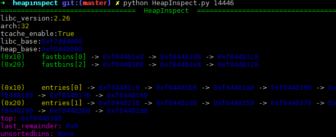
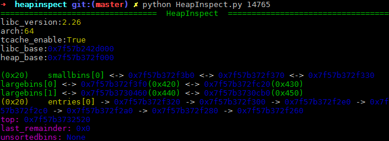
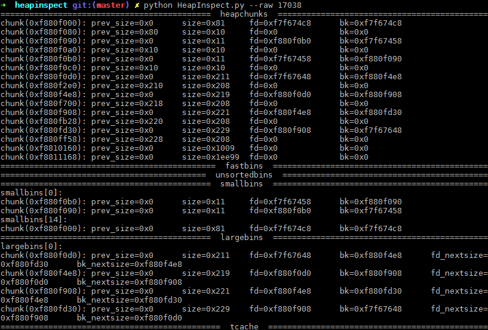
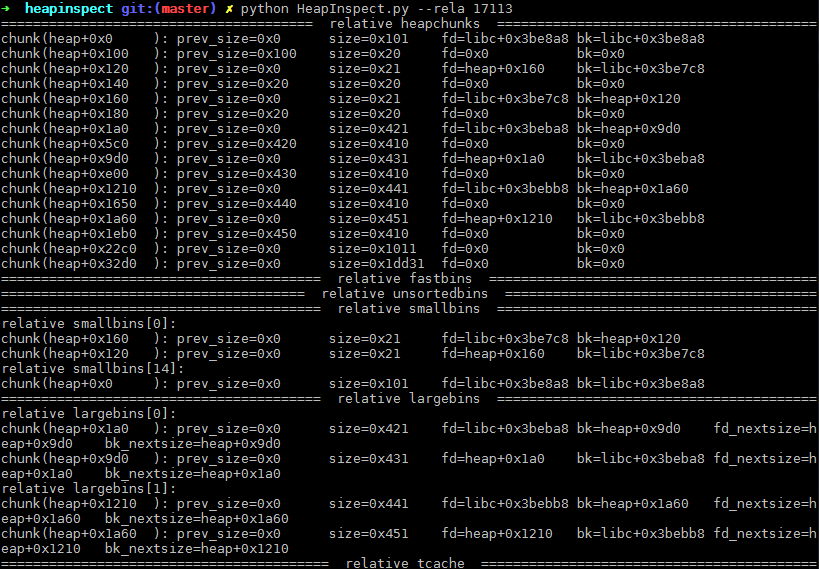
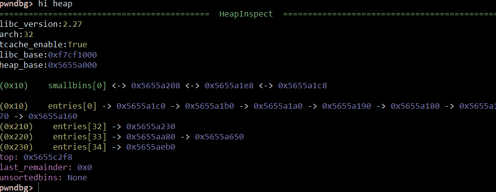
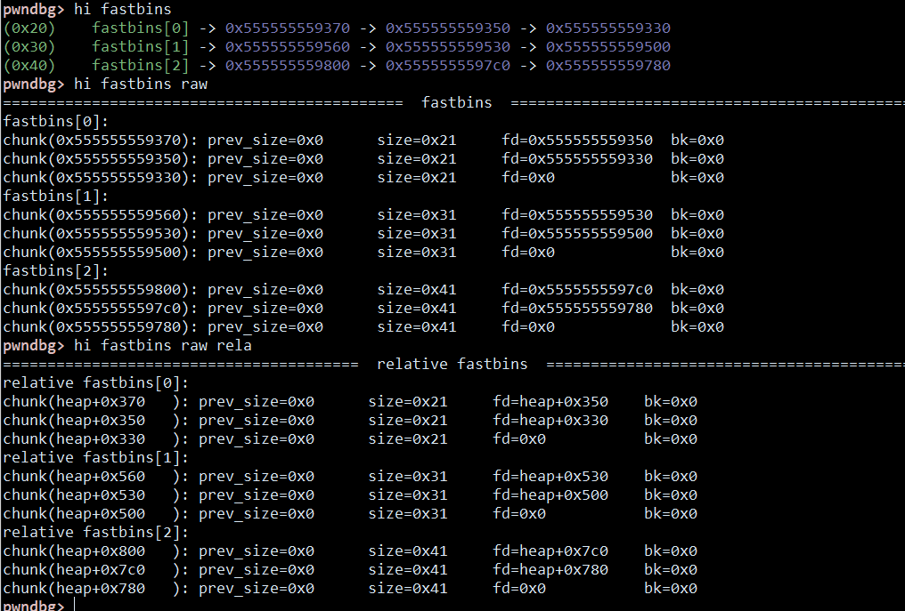
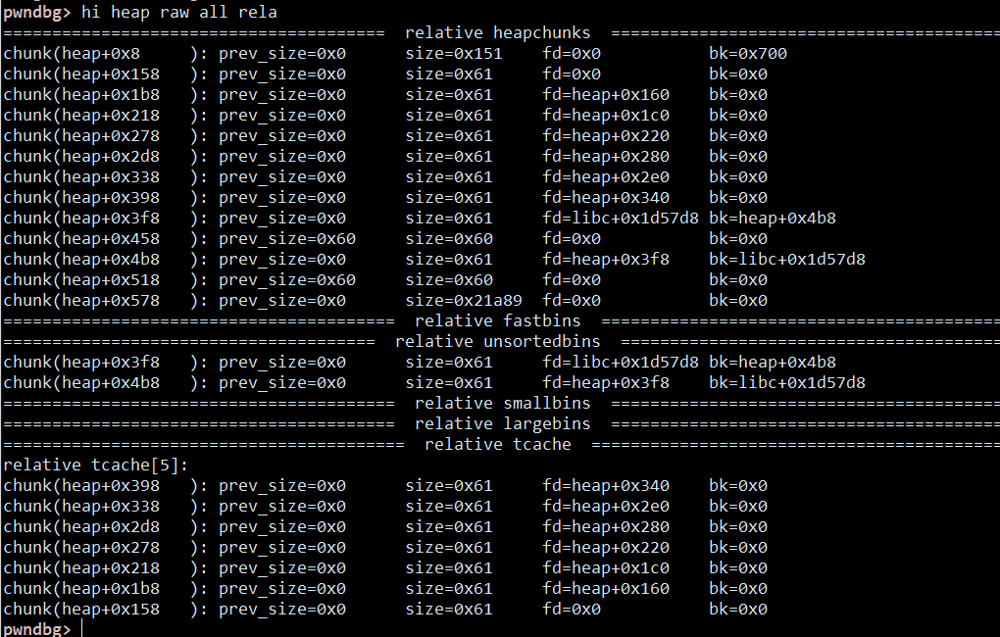

# HeapInspect

_Pwnning is an art._

`HeapInspect` is designed to make `heap` much more prettier.

**Now this tool is a plugin of [nadbg](https://github.com/matrix1001/nadbg). Try it!**

## Features

- Free of gdb and other requirement
- Multi glibc support
    - 2.19, 2.23-2.27 (currently tested)
    - both 32bit and 64bit
- Nice UI to show heap
    - `HeapShower` (detailed)
    - `PrettyPrinter` (colorful, summary)
- Heapdiff (working)
- Corruption detect & exploit analysis (working)
- Also support gdb
- Python2 & Python3 compatible

# Usage

## Quick shot

A quick use of this tool.









You can also use it as a gdb plugin, very useful when `pwndbg` or other plugins failed to analysis heap.
```sh
sed -i "1i source `pwd`/gdbscript.py" ~/.gdbinit # alternatively, you can add that line manually
```

__Note__









## Basic

Pretty easy to use. I will make it a package later.

```python
from heapinspect.core import *
hi = HeapInspect(1234)       #pid here
hs = HeapShower(hi)

print(hs.fastbins)
print(hs.smallbins)
print(hs.largebins)
print(hs.unsortedbins)
print(hs.tcache_chunks)

hs.relative = 1              #relative mode, check Quick shot
print(hs.fastbins)

sleep(10)
#now assume that the heap state has changed
hs.update()                  #use this to refresh

pp = PrettyPrinter(hi)
print(pp.all)                #pretty printer
pp.update()                  #use this to update
```

## Test 

There are some testcases.

```raw
heapinspect/tests/ $ python test.py  #this will run all test cases for you to check this tool.

......
......

test case unsortedbins64 at test/testcases/libc-2.27/64bit
pid:6704
=========================           fastbins           =========================
=========================         unsortedbins         =========================
chunk(0x7f9aae2e6720): prev_size=0x0      size=0xb1     fd=0x7f9aacdfbca0  bk=0x7f9aae2e6880
chunk(0x7f9aae2e6880): prev_size=0x0      size=0xb1     fd=0x7f9aae2e6720  bk=0x7f9aacdfbca0
=========================          smallbins           =========================
=========================          largebins           =========================
=========================            tcache            =========================
tcache[9]:
chunk(0x7f9aae2e6670): prev_size=0x0      size=0xb1     fd=0x7f9aae2e65d0  bk=0x0
chunk(0x7f9aae2e65c0): prev_size=0x0      size=0xb1     fd=0x7f9aae2e6520  bk=0x0
chunk(0x7f9aae2e6510): prev_size=0x0      size=0xb1     fd=0x7f9aae2e6470  bk=0x0
chunk(0x7f9aae2e6460): prev_size=0x0      size=0xb1     fd=0x7f9aae2e63c0  bk=0x0
chunk(0x7f9aae2e63b0): prev_size=0x0      size=0xb1     fd=0x7f9aae2e6310  bk=0x0
chunk(0x7f9aae2e6300): prev_size=0x0      size=0xb1     fd=0x7f9aae2e6260  bk=0x0
chunk(0x7f9aae2e6250): prev_size=0x0      size=0xb1     fd=0x0             bk=0x0
```

# Docs

Detailed docstrings have been written into the source code.

I have built a sphinx doc in `docs`. Just open `docs/build/html/index.html` with your browser.

# Devlog

## 2020/5/11 Version 0.1.4

- python3 support

## 2018/12/10 Version 0.1.3

- add support for gdb

## 2018/11/6 version 0.1.2

docs update.

- update sphinx docs
- reshape file structure

## 2018/11/5 version 0.1.1

not a functional update.

- PEP8
- docstrings
- performance update

## 2018/10/31 version 0.1.0

first release

- better cmdline option
  
## 2018/10/30 version 0.0.8

next version will be a release.

- CRLF to LF
- code refine
- readme refine
- pretty printer

## 2018/10/29 version 0.0.7

- auto test
- code refine

## 2018/10/27 version 0.0.6

this is not a stable version. im trying to fix bugs due to different glibc. i need help to test this.

- add multi libc support
- add x86 support 

## 2018/10/26 version 0.0.5

next version will add multi libc support. heapdiff and heap check will be added later.

- `HeapShower`
- relative heap & libc offset showing
- fix search loop bug
- `bins` now search from `bk` instead of `fd`, as the manner of glibc

## 2018/10/24 version 0.0.4

- `HeapRecoder` , I will make a heapdiff
- `smallbins` and `largebins`

## 2018/10/23 version 0.0.3

- `fastbin` prototype
- `unsortedbin` prototype
- `bins` prototype
- `tcache` prototype

## 2018/10/22 version 0.0.2

- add `C_Struct` to handle c structure

## 2018/10/19 version 0.0.1

- add `class HeapInspector`
- trying to parse more information of `arena`

## 2018/10/18 version 0.0.0

- add `class Proc` in `proc_util`
- experimental test in `test.py`