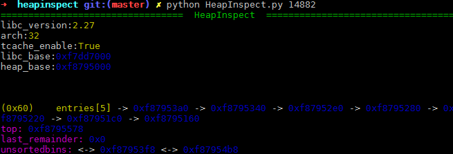

# HeapInspect

Dynamically Inspect Heap In Python.
Core concept is to inspect heap by a given pid. 

**NO PTRACE, NO GDB, NO NEED OF LIBC**. 

Future use can fall in heap check and pwn exploration.

However, I'm starting to work on it. Code is ugly and functions are not complete.

Best performace on `ipython`.

__Advantage over gdb plugins (like pwndbg)__

- No gdb needed. 
- No ptrace needed. Won't interrupt the process.
- Implemented in pure python. No other module needed.
- No symbols needed. (pwndbg need libc symbols to resolve `main_arena`)
- Easy to use API.
- Heap diff. (Working on it)
- blablabla......  


# Usage

__Now support multi glibc (tested on 2.23-2.27, both x64 and x86)__

## Quick shot

A quick use of this tool.





## Basic

Pretty easy to use. I will make it a package in the first release.

```python
from HeapInspect import *
hi = HeapInspect(1234)       #pid here
#hs = HeapShower(hi)         #this will be super slow because of dynamic IO
hs = HeapShower(hi.record)   #use this to speed up 

print(hs.fastbins)
print(hs.smallbins)
print(hs.largebins)
print(hs.unsortedbins)
print(hs.tcache_chunks)

hs.relative = 1              #relative mode, check Quick shot
print(hs.fastbins)

sleep(10)
#now assume that the heap state has changed
hs.hi = hi.record            #use this to refresh. if you used `hs = HeapShower(hi)`, no need of this.

pp = PrettyPrinter(hi.record)
print(pp.all)                #pretty printer
```

## Test 

There are some testcases.

```raw
heapinspect $ python test.py  #this will run all test cases for you to check this tool.

......
......

test case unsortedbins64 at test/testcases/libc-2.27/64bit
pid:6704
=========================           fastbins           =========================
=========================         unsortedbins         =========================
chunk(0x7f9aae2e6720): prev_size=0x0      size=0xb1     fd=0x7f9aacdfbca0  bk=0x7f9aae2e6880
chunk(0x7f9aae2e6880): prev_size=0x0      size=0xb1     fd=0x7f9aae2e6720  bk=0x7f9aacdfbca0
=========================          smallbins           =========================
=========================          largebins           =========================
=========================            tcache            =========================
tcache[9]:
chunk(0x7f9aae2e6670): prev_size=0x0      size=0xb1     fd=0x7f9aae2e65d0  bk=0x0
chunk(0x7f9aae2e65c0): prev_size=0x0      size=0xb1     fd=0x7f9aae2e6520  bk=0x0
chunk(0x7f9aae2e6510): prev_size=0x0      size=0xb1     fd=0x7f9aae2e6470  bk=0x0
chunk(0x7f9aae2e6460): prev_size=0x0      size=0xb1     fd=0x7f9aae2e63c0  bk=0x0
chunk(0x7f9aae2e63b0): prev_size=0x0      size=0xb1     fd=0x7f9aae2e6310  bk=0x0
chunk(0x7f9aae2e6300): prev_size=0x0      size=0xb1     fd=0x7f9aae2e6260  bk=0x0
chunk(0x7f9aae2e6250): prev_size=0x0      size=0xb1     fd=0x0             bk=0x0
```

# Structure

File structure of this project is pretty simple.

## proc_util

This module handles everything about `/proc/pid/`, including memory reading, vmmap analyzing and so on.

## libc_util

This module handles everything about `glibc`, including getting `main_arena` offset, generating c like structure and so on.

## HeapInspect

Core script of this project. `HeapInspector` parses `heap` and `main_arena`. `HeapRecorder` sees to record the state of heap. `HeapShower` manages to make a user interface and does some semantic analysis.


# Devlog

## 2018/10/30 version 0.0.8

next version will be a release.

- CRLF to LF
- code refine
- readme refine
- pretty printer

## 2018/10/29 version 0.0.7

- auto test
- code refine

## 2018/10/27 version 0.0.6

this is not a stable version. im trying to fix bugs due to different glibc. i need help to test this.

- add multi libc support
- add x86 support 

## 2018/10/26 version 0.0.5

next version will add multi libc support. heapdiff and heap check will be added later.

- `HeapShower`
- relative heap & libc offset showing
- fix search loop bug
- `bins` now search from `bk` instead of `fd`, as the manner of glibc

## 2018/10/24 version 0.0.4

- `HeapRecoder` , I will make a heapdiff
- `smallbins` and `largebins`

## 2018/10/23 version 0.0.3

- `fastbin` prototype
- `unsortedbin` prototype
- `bins` prototype
- `tcache` prototype

## 2018/10/22 version 0.0.2

- add `C_Struct` to handle c structure

## 2018/10/19 version 0.0.1

- add `class HeapInspector`
- trying to parse more information of `arena`

## 2018/10/18 version 0.0.0

- add `class Proc` in `proc_util`
- experimental test in `test.py`